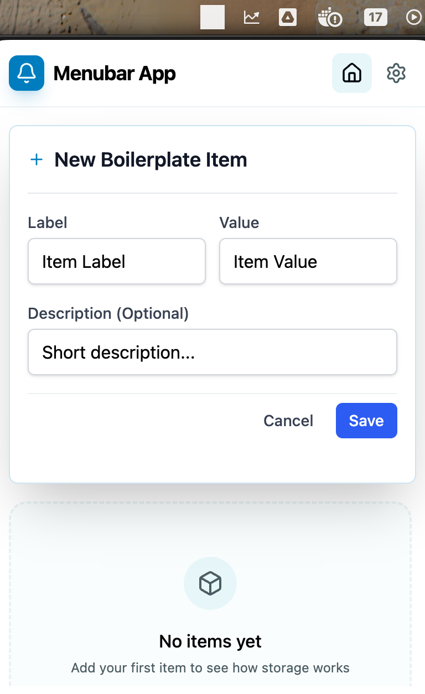
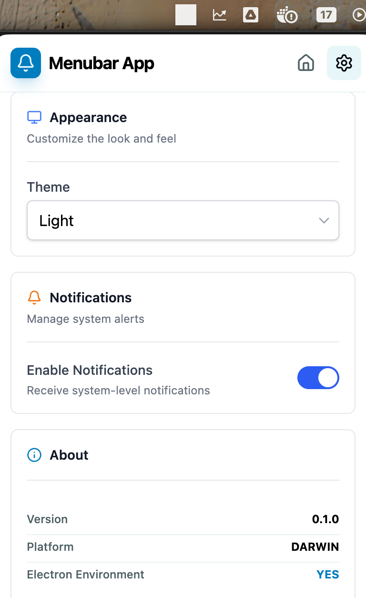

# Electron React Boilerplate

Electron + React + TypeScript + Tailwind CSS boilerplate for building cross-platform desktop menu bar applications.

## Screenshots

 

## Quick Start

```bash
npm install
npm run electron:dev
```

## Features

- Electron + React 18 + TypeScript + Vite
- Tailwind CSS v4
- Pre-built UI components (Button, Card, Input, Select, Toggle, etc.)
- Hot reload during development
- Production builds with Electron Builder

## Scripts

```bash
npm run electron:dev      # Start development
npm run electron:build   # Build for production
npm run electron:dist    # Create distributable
npm run test             # Run tests
```
